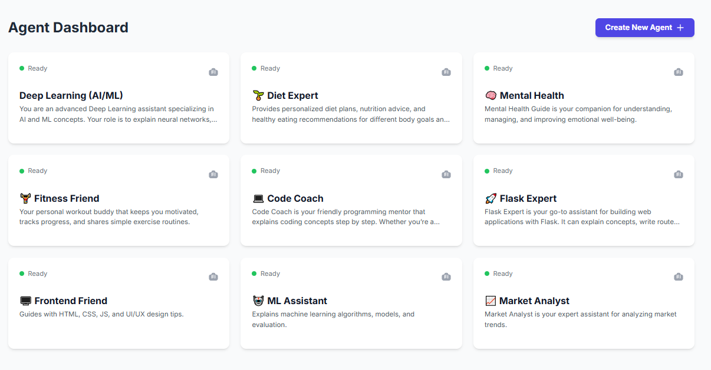
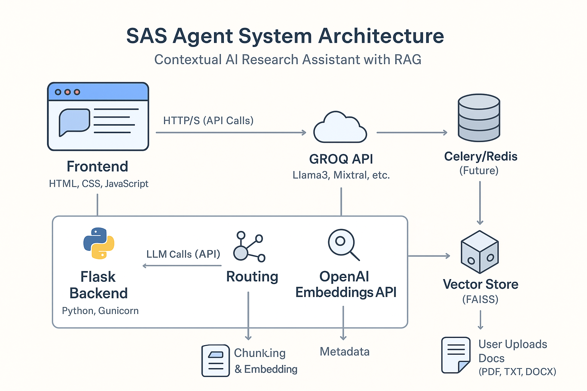

<p>
  
  
  
</p>

**“Where retrieval meets intelligence”**  

Create, chat, and research with your own **mini AI experts**.  
Each agent has its own memory, document knowledge base, and runs with **Groq API** for ultra-fast inference.

---


## 🚀 Demo

  
*Quick demo of creating an agent, uploading a document, and chatting with it.*

---

## ✨ Features

- 🧑‍💻 **Custom Agents** – Create agents with unique names & descriptions  
- 💾 **Persistent Memory** – Chat history & agent data stored in SQLite  
- 📚 **Document Uploads** – Upload PDFs/notes, stored in FAISS/ChromaDB for retrieval  
- ⚡ **Groq API** – Leverages Groq’s blazing-fast LLM inference  
- 🌐 **Simple Web UI** – Built with HTML, CSS, and JavaScript (no frameworks)  
- 🛠 **Extendable** – Easy to add new agents, tools, or integrations  

---

## 🏗️ Architecture



**Flow:**  
User → Web UI → Flask Backend → SQLite (agents + history) + FAISS/ChromaDB (docs) + Groq API (LLM)

---

## ⚙️ Tech Stack

- **Frontend:** HTML, CSS, JavaScript  
- **Backend:** Python (Flask)  
- **Database:** SQLite (agents, chat history)  
- **Vector DB:** FAISS / ChromaDB  
- **Model:** Groq API (cloud inference)  

---

## 📥 Installation

```bash
# enviroment
Create virtual environment

# recommended 
python - 3.11/3.12

# to download all dependencies 
pip install -r requirements.txt

#optional
git clone https://github.com/yourusername/yourprojectname


 


````

---

## ▶️ How to run 

```bash
# Run the celery for seamless document chunking in background (run exact command for error free output)
celery -A manage.celery worker --loglevel=info -P solo
```

Note : `Download redis in your system`

```bash
# Run the Flask backend
flask --app manage:app run
```

Open browser at `http://127.0.0.1:5000`

**Steps:**

1. Create a new agent (name + description)
2. Upload upto 1k+ research documents.txt
3. Start chatting with your agent

**Note:**
```bash
# make sure your api's are in .env 
.env -> both api (text and image processing both)
```

---

## 📂 Folder Structure

```
sas-agent/
│── app.py                # Flask backend
│── static/               # Frontend CSS/JS
│── templates/            # HTML templates
│── database/             # SQLite DB
│── vectorstore/          # FAISS/ChromaDB files
│── assets/               # Images, GIFs (for README)
│── requirements.txt
│── README.md
```


```
## 📜 License

MIT License – feel free to use and modify.
Contributions are welcome 🚀

```


```bash
image processing gemini api is used ensure your google cloud console is activated with billings (it free as of now but billing must be active )

```
